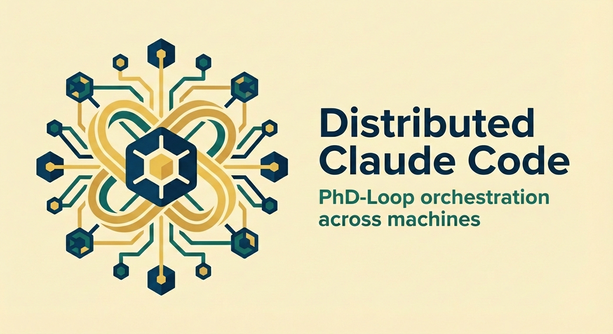
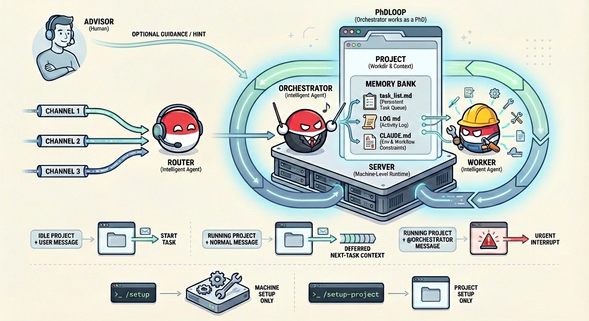

# Distributed Claude Code

<p align="center">
  
</p>

*Work as an advisor!* Run Claude Code across multiple servers from one local chat interface (Web UI or Telegram), with a persistent **PhDLoop** runtime (Orchestrator + Worker).

<p align="center">
  
</p>

## Why This Exists

Distributed Claude Code is optimized for this workflow:

1. Humans should not manually track many concurrent sessions.
2. The orchestrator should keep progress moving autonomously, while the user gives high-level advice and course corrections.

Core components:

- **Router** (local): message routing + setup/sysadmin helper.
- **Daemon** (remote per machine): long-lived orchestrator runtime.
- **Orchestrator** (remote): plans, delegates, verifies, updates project memory.
- **Worker** (remote): executes concrete assignments.

Persistent artifacts per project:

- `task_list.md`: current research/task plan
- `LOG.md`: lab notebook (decisions, findings, pivots)

## Quick Start (Web, Recommended)

### 1. Install

```bash
git clone https://github.com/dangxingyu/distributed-cc.git
cd distributed-cc
uv sync --extra dev
```

### 2. Run locally

```bash
make run
```

Open `http://localhost:8080`.

### 3. Create your first setup channel

Click **+ New Setup Channel** in the sidebar.

- Fill `Channel name`
- Fill `Server` as `user@host`
- Click `Create + setup`

The UI sends `/setup user@host` automatically.

First run note: no manual config files are required. Router can create/update
`config.json` during setup flow. `config.md` is optional notes for better setup context.

### 4. Complete project setup

After machine setup finishes, continue with:

```text
/setup-project <workdir or instruction>
```

This step creates/updates one project entry and gives you `/connect <project-id>`.

### 5. Connect and run work

```text
/connect <project-id>
Investigate why training loss plateaus and propose a fix.
```

## Core Abstractions (Read First)

- **Server (machine)**: connectivity/runtime endpoint (`host` + `broker_port`) where a daemon runs.
- **Project**: one concrete workdir on a server, identified by `project_id`.
- **Channel**: one conversation thread in UI; a channel is connected to at most one project at a time.
- **Orchestrator/Worker sessions**: persistent Claude sessions owned by a project (not by a channel).

Binding rules:

- One server can host many projects.
- Many channels can point to the same project.
- If channels share a project, they observe the same orchestrator/worker runtime state.
- Router setup sessions are per-channel; execution sessions (orchestrator/worker) are per-project.

## Setup Model (Important)

### `/setup` = machine setup only

`/setup user@host` handles server infrastructure only:

- daemon deployment/start
- local tunnel wiring
- machine-level entry update in `config.json`

It **must not** set project workdirs or project CLAUDE memory.

### `/setup-project` = project setup only

`/setup-project ...` handles project configuration only:

- resolve concrete workdir
- create/update one project entry
- prepare project memory files in the workdir
- verify health on selected broker port

## Core Commands

| Command | Purpose |
|---|---|
| `/connect <project-id>` | Connect current channel to one project |
| `/connect` | Show current connection |
| `/status` | Show current project/daemon status |
| `/queue [list|edit|delete|move|clear]` | Inspect or modify queued next-task items for current project |
| `/orchestrator_plugin <instruction>` | Configure role-specific MCP servers for orchestrator (`.claude/mcp/orchestrator.json`) |
| `/worker_plugin <instruction>` | Configure role-specific MCP servers for worker (`.claude/mcp/worker.json`) |
| `/stop` | Stop current running router/orchestrator task |
| `/setup <user@host> [--manual-tunnel]` | Machine setup (daemon + tunnel) |
| `/setup` | Health-check configured machine endpoints |
| `/setup-project <workdir or instruction>` | Project setup on an existing machine |
| `/doctor [hint]` | Diagnose daemon/tunnel/register status using channel context + config |
| `/upgrade-check [hint]` | Check remote daemon/runtime drift against GitHub latest; ask before upgrade |
| `/setup_project <workdir or instruction>` | Telegram-friendly alias |

Mentions:

- `@router ...`: direct router/sysadmin message
- `@orchestrator ...`: urgent message to running orchestrator

## Routing Behavior

Without mentions:

- No project connected: message goes to **Router**
- Project connected + idle: message starts new orchestrator task
- Project connected + running: message is queued as non-urgent next-task context
- Queue/runtime scope is **per-project**, so channels connected to the same project share the same running state and next-task queue.

Urgency while running:

- Plain message: non-urgent guidance
- `@orchestrator ...`: urgent interruption

## Heartbeat Behavior

Heartbeat only runs in **standby** state (`done/idle`): daemon wakes orchestrator for lightweight triage only when meaningful signals exist (for example queued advisor messages or unchecked `task_list.md` items).

Defaults:

- `STANDBY_HEARTBEAT_SECONDS=1800` (~30 minutes)
- `STANDBY_WAKE_MAX_ITERATIONS=1`

## Session Context & Compaction

- Orchestrator and worker keep reusing the same SDK session via `resume`.
- When context fills, Claude may auto-compact and continue the session.
- After compact, behavior continues, but raw full history is no longer guaranteed in-context.
- Durable memory should live in project files (`task_list.md`, `LOG.md`, and `CLAUDE.md`), not only in chat context.

## Configuration

`config.json` and `config.md` are both optional.

- `config.json`: structured machine/project config (good for stable multi-server workflows).
- `config.md`: free-form setup/environment notes for Router (cluster layout, SLURM habits, preferred paths, etc.).

You can use either mode:

1. **Config-first**: prepare `config.json` (and optionally `config.md`) before running.
2. **Adhoc-first**: create a channel and talk to setup agent in-channel (`/setup ...` then `/setup-project ...`) without pre-writing config files.

Start from template:

```bash
cp config.example.json config.json
```

Canonical config shape (project-centric):

```json
{
  "machines": [
    {
      "name": "della-gpu",
      "host": "ubuntu@host-or-ip",
      "broker_port": 8201
    }
  ],
  "projects": [
    {
      "project_id": "proj-a",
      "machine": "della-gpu",
      "work_dir": "/home/ubuntu/project-a"
    }
  ],
  "orchestrator": {
    "model": "claude-opus-4-6",
    "session_model": "claude-opus-4-6",
    "permission_mode": "bypassPermissions"
  }
}
```

Field notes:

- `machines[].name`: machine key referenced by `projects[].machine`
- `machines[].host`: SSH destination (`null` for local)
- `machines[].broker_port`: local forwarded port to daemon `:8200`
- `projects[].project_id`: id used by `/connect`
- `projects[].work_dir`: project root on target machine
- `orchestrator.*`: default daemon runtime model/policy

Compatibility:

- `servers[]` (legacy) and `orchestrators[]` schemas are still supported.
- For new setups, treat `machines[] + projects[]` as the default path.
- Treat `servers[]`/`orchestrators[]` as migration compatibility, not the primary workflow.

`config.json` is local-only. Never commit real hosts/tokens.

## Telegram Mode

Run:

```bash
TELEGRAM_BOT_TOKEN=<token> uv run python -m src --frontend telegram
```

Then add the bot to a group or DM it directly.

Run Web + Telegram together:

```bash
TELEGRAM_BOT_TOKEN=<token> uv run python -m src --frontend both
```

In `both` mode, Web and Telegram share project runtime state, while each frontend only renders its own channels (legacy untagged channels stay on Web).

## Manual Daemon Setup (Optional)

Only needed if you do not use `/setup`.
For long-lived reliability, prefer `systemd` services for daemon and tunnels.

Remote server:

```bash
curl -LsSf https://astral.sh/uv/install.sh | sh
mkdir -p ~/.distributed-cc
scp tools/orchestrator_daemon.py user@server:~/.distributed-cc/orchestrator_daemon.py
ssh user@server "cd ~/.distributed-cc && uv venv .venv && uv pip install --python .venv/bin/python3 claude-agent-sdk aiohttp"
ssh user@server "tmux new-session -d -s daemon '~/.distributed-cc/.venv/bin/python3 ~/.distributed-cc/orchestrator_daemon.py --port 8200 --name server-a --callback-url http://127.0.0.1:9120'"
```

Local laptop:

```bash
ssh -N -L 8201:localhost:8200 -R 9120:localhost:9120 user@server
curl http://127.0.0.1:8201/health
```

## Troubleshooting

### Router cannot reach daemon

- Check tunnel health: `curl http://127.0.0.1:<broker_port>/health`
- Check daemon process remotely (`tmux ls`)
- On `/connect`, Router now attempts one non-interactive tunnel self-heal (`ssh -fNT ...`) for remote hosts.
  This requires key-based SSH auth (`BatchMode=yes`); password-only hosts still need manual `/setup` or tunnel restart.
  Set `DCC_AUTO_RECOVER_TUNNEL=0` to disable this behavior.
- In a channel, run `/doctor [hint]` to let Router diagnose current project/server context
- Run systematic diagnostics (health signature + register/status probes):
  `make doctor`
  or scoped check: `make doctor DOCTOR_ARGS="--project <project-id> --timeout 3"`

### No progress in UI

- Verify reverse tunnel `-R 9120:localhost:9120`
- Confirm router process is running locally

### `/connect <id>` unknown project

- Confirm `config.json` has that `projects[].project_id` (or `servers[].name` in legacy config)
- Retry `/connect <project-id>`; router reloads config automatically when needed

## Testing

`make test-e2e` uses real Claude calls. Ensure credentials are available and expect usage cost.

```bash
make test
make test-e2e
make test-e2e E2E_JOBS=4
```

## Project Layout

```text
src/
  main.py            entrypoint (router + frontend + callback server)
  router.py          routing, daemon IO, queueing
  router_session.py  local setup/sysadmin Claude session
  web.py             HTTP/WebSocket backend
  telegram_chat.py   Telegram backend
  store.py           JSON persistence
  static/index.html  Web UI

tools/
  orchestrator_daemon.py  remote daemon runtime
  deploy.sh               deploy helper
  start_tunnels.sh        tunnel helper

docs/
  design-philosophy.md
  message-flow.md
  broker-guide.md
  native-prompts.md
```

## Requirements

Local machine:

- Python 3.10+
- [uv](https://docs.astral.sh/uv/)
- SSH client

Remote machine:

- Claude Code CLI
- Python 3.10+ (and ability to run long-lived daemon via `tmux` or `systemd`)
